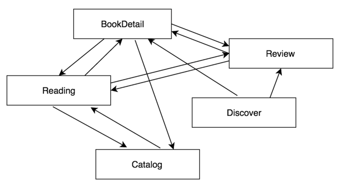
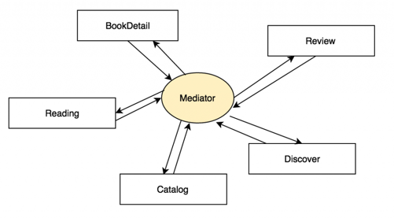
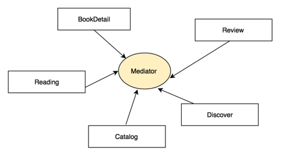

#iOS组件化方案说明
##一、什么是组件化？
###什么是组件？
"组件"一般来说用于命名比较小的功能块，如：下拉刷新组件、提示框组件。而较大粒度的业务功能，我们习惯称之为"模块"，如：首页模块、我的模块、新闻模块。

这次讨论的主题是组件化，这里为了方便表述，下面模块和组件代表同一个意思，都是指较大粒度的业务模块。

###什么是组件化？
组件化，或者说模块化，用来分割、组织和打包软件。每个模块完成一个特定的子功能，所有的模块按某种方法组装起来，成为一个整体，完成整个系统所要求的功能。

从工程代码层面来说，组件化的实施通常是通过中间件解决组件间头文件直接引用、依赖混乱的问题；从实际开发来说，组件之间最大的需求就是页面跳转，需要从组件A的pageA页面跳转到组件B的pageB页面，避免对组件B页面ViewController头文件的直接依赖。

##二、为什么要组件化
从两个方面论述：
###组件化是为了解决什么问题？

一个 APP 有多个模块，模块之间会通信，互相调用，如我们的证券app，有首页、行情、资讯、我的等模块。这些模块会互相调用，例如 首页底部需要展示部分资讯、行情；行情底部需要展示个股资讯；资讯详情页需要跳转到行情，等等。

一般我们是怎样调用呢，以首页调用资讯为例，会这样写：

<pre><code>#import "HomeViewController.h"
#import "NewsViewController.h"

@implementation HomeViewController

+ (void)gotoNews {

 NewsViewController *detailVC = [[NewsViewController alloc] initWithStockCode:self.codeNum];
 [self.navigationController.pushViewController:detailVC animated:YES];
}

@end
</code></pre>

看起来挺好，这样做简单明了，没有多余的东西，项目初期推荐这样快速开发，但到了项目越来越庞大，这种方式会有什么问题呢？

<li>问题1，每个模块都离不开其他模块，互相依赖粘在一起成为一坨：</li>

耦合比较严重（因为没有明确的约束，模块「组件」间引用的现象会比较多）

<li>问题2，多人同时开发时，容易出现冲突（尤其是Xcode Project文件）</li>
<li>问题3，业务方的开发效率不够高（只关心自己的组件，却要编译整个项目，与其他不相干的代码糅合在一起）</li>

###组件化的好处？
####一般意义：
<ol>
<li>加快编译速度（不用编译主客那一大坨代码了）</li>
<li>各组件自由选择开发姿势（MVC / MVVM / FRP）</li>
<li>组件工程本身可以独立开发测试，方便 QA 有针对性地测试</li>
<li>规范组件之间的通信接，让各个组件对外都提供一个黑盒服务，减少沟通和维护成本，提高效率</li>
</ol>

####对于已有项目的现实意义：
<ol>
<li>业务分层、解耦，使代码变得可维护</li>
<li>有效的拆分、组织日益庞大的工程代码，使工程目录变得可维护</li>
<li>便于各业务功能拆分、抽离，实现真正的功能复用</li>
<li>业务隔离，跨团队开发代码控制和版本风险控制的实现</li>
<li>模块化对代码的封装性、合理性都有一定的要求，提升开发人员的设计能力</li>
<li>在维护好各级组件的情况下，随意组合满足不同客户需求；（只需要将之前的多个业务组件模块在新的主App中进行组装即可快速迭代出下一个全新App）</li>
</ol>
###什么情况下进行组件化比较合适？
当然组件化也有它的缺点：
<li>学习成本高，对于开发人员对各种工具的掌握要求也比较高，对于新手来说入门较为困难</li>
<li>由于工具和流程的复杂化，导致团队之间协作的成本变高，部分情况下可能会导致开发效率下降。</li>

当项目App处于起步阶段、各个需求模块趋于成熟稳定的过程中，组件化也许并没有那么迫切，甚至考虑组件化的架构可能会影响开发效率和需求迭代。

而当项目迭代到一定时期之后，便会出现一些相对独立的业务功能模块，而团队的规模也会随着项目迭代逐渐增长，这便是中小型应用考虑组件化的时机了。这时为了更好的分工协作，团队安排团队成员各自维护一个相对独立的业务组件是比较常见的做法。

在这时这个时候来引入组件化方案，是比较合适的时机。长远来看，组件化带来的好处是远远大于坏处的，特别是随着项目的规模增大，这种好处会变得越来越明显！！

##三、如何组件化？
组件化的开展需要解决以下几个层次的问题：

###组件化的架构目标？
参考Limboy的图：

###如何划分组件？
<ul>
<li>基础功能组件</li>
<li>基础产品组件</li>
<li>个性化业务组件</li>
</ul>
对于一个没有实施过组件化拆分的工程来说，其中很可能充满了大量不合理的类、方法、头文件和各种错乱的依赖关系，因此首先要进行的第一步是模块拆分。

模块拆分可以分成两个部分，基础模块拆分和业务模块拆分。基础模块通常是稳定的依赖代码，业务模块是涉及到业务的需要频繁改动的代码。

>基础模块拆分

基础模块是任何一个App都需要用到的，如：性能统计、Networking、Patch、网络诊断、数据存储模块。对于基础模块来说，其本身应该是自洽的，即可以单独编译或者几个模块合在一起可以单独编译。所有的依赖关系都应该是业务模块指向基础模块的。 基础模块之间尽量避免产生横向依赖。

>业务模块拆分

对于业务模块来说，考虑到旧有代码可能没有相关的横向解耦策略，业务模块之间的依赖会非常复杂，难以单独进行拆分，因此我们采用的方法是首先从 group 角度进行重新整理。

对业务量很大的工程来说，我个人更加推荐“业务-分层”这样的结构，而不是“分层-业务”。
即类似下面的 group 结构：
<pre><code>- BusinessA
  - Model
  - View
  - Controller
  - Store
- BusinessB
  - Model
  - View
  - Controller
  -Store
</code></pre>

而非目前项目中采用的：
<pre><code>- Controllers
  - BusinessA_Controller
  - BusinessB_Controller
- Views
  - BusinessA_View
  - BusinessB_View
- Models
  - BusinessA_Model
  - BusinessB_Model
</code></pre>

###组件化的技术难点？
>组件化的实施，直观上看，只是需要将各业务组件的代码放到各自的文件夹或者 jar包里就行了。

这里引出的是：
####1、组件的拆分方式问题：
可以利用CocoaPods 配合 git 做代码版本管理，独立业务模块单独成库。

但这仅仅是物理上拆分了，拆分后的代码编译是肯定通不过的，因为如下：

<pre><code>
#import "MainViewController.h"
#import "HomeViewController.h"
#import "NewsViewController.h"
#import "MeViewController.h"
#import ...

@implementation MainViewController

@end
</code></pre>
MainViewController 会找不到依赖的其它各个模块的头文件而报错。这里引出的又是另一个问题：

####2.组件间如何解耦？
组件间解耦，是组件化必须解决的一个问题。换句话说，就是如何解除业务模块间的横向依赖。还是拿上边举得例子来说：

（App的根视图MainViewController需要管理首页、新闻、我的等等页面时，如何做到 MainViewController 中，不用去 import这一大堆 XXViewController ?）

很简单，按软件工程的思路，下意识就会加一个中间层Mediator：

这样一来，各个模块直接都不需要再互相依赖，而是仅需要依赖 Mediator 层即可。

可直观上看，这样做并没有什么好处，依赖关系并没有解除，Mediator 依赖了所有模块，而调用者又依赖 Mediator，最后还是一坨互相依赖，跟原来没有 Mediator 的方案相比除了更麻烦点其他没区别。

对此，可以参考业内的流行方案：
<li>基于 URL Router、ModuleManager 代表：<a href="http://reviewcode.cn/article.html?reviewId=20">蘑菇街</a></li>
<li>基于 Target-Action、Runtime、Category 代表：<a href="http://casatwy.com/iOS-Modulization.html?hmsr=toutiao.io&utm_medium=toutiao.io&utm_source=toutiao.io">安居客 casa</a></li>

具体实现方案较为抽象，这里暂时先不详细展开论述，可以参见Demo：

<a href="https://github.com/CallMeDK/CTMediator">Demo1 基于 Target-Action</a>

<a href="https://github.com/CallMeDK/routable-ios">Demo2 基于 Target-Action</a>

##四、其它
###开发流程控制
> 托管平台选择
自己利用开源的方案搭建私有的托管平台，可以最大限制地保证代码的安全。开源方案当中最知名也是最为广泛使用的当属 Gitlab。

组件化使我们从单一的主工程，变成了主工程+多个拆分好的基础模块+统一的私有 Spec 仓库。为了避免某个人的工作对其他人开发环境造成影响，需要对整个组的开发流程进行统一的规范。

不管是对于主仓库和子模块仓库，git-flow 都是首先推荐的工作流程。一个仓库的 master 分支只有所有者可以有权限更改，其他的贡献者想更改的话，需要自己创建新的分支（在 Github 上就是进行 fork），然后进行更改，之后把更改向原仓库发送 Pull Request。Pull Request 就是一个合并的请求，其中可以看到贡献者的更改，项目主人和其他维护者可以对 Pull Request 进行审核，共同探讨修改意见。当项目主人认为修改 OK 之后，就可以合并这个 Pull Request ，把这部分代码合并到主分支。

这个流程是完全分布式的，也就是说可以同时有多个贡献者在不同的分支进行工作，最后统一合并到主分支上，实现并行协作。

同时在审核 Pull Request 阶段，除了人工审核代码之外，Github 还加入了对于持续集成的支持，可以检测这个 Pull Request 是不是能够通过测试的，进一步保证了代码的质量。

##参考资料
相关技术博客：

1、<a href="http://casatwy.com/iOS-Modulization.html?hmsr=toutiao.io&utm_medium=toutiao.io&utm_source=toutiao.io">iOS应用架构谈 组件化方案</a>

2、<a href="http://limboy.me/ios/2016/03/10/mgj-components.html">蘑菇街 App 的组件化之路</a>

<a href="http://limboy.me/ios/2016/03/14/mgj-components-continued.html">蘑菇街 App 的组件化之路·续</a>

3、<a href="http://blog.cnbang.net/tech/3080/">iOS 组件化方案探索</a>

4、<a href="http://www.reviewcode.cn/article.html?reviewId=20">《iOS应用架构谈 组件化方案》和《蘑菇街 App 的组件化之路》的阅读指导</a>

5、<a href="https://skyline75489.github.io/post/2016-3-16_ios_module_design.html
">浅析 iOS 应用组件化设计</a>

6、<a href="http://chuansong.me/n/320688951236">糯米移动组件架构演进之路</a>

7、<a href="https://www.sdk.cn/news/2023">饿了么移动APP的架构演进</a>

8、<a href="https://mp.weixin.qq.com/s?__biz=MzA3ODg4MDk0Ng%3D%3D&idx=1&mid=402854111&sn=5876e615fabd6d921285d904e16670fb
">滴滴出行iOS客户端架构演进之路</a>

9、<a href="http://www.aliog.com/101363.html
">ios业务模块间互相跳转的解耦方案</a>

10、<a href="http://cdn0.jianshu.io/p/afb9b52143d4
">iOS组件化思路－大神博客研读和思考</a>

11、<a href="https://blog.cnbluebox.com/blog/2015/11/28/module-and-decoupling/
">模块化与解耦</a>

相关解决方案

1、<a href="https://github.com/casatwy/CTMediator">casatwy/CTMediator</a>

2、<a href="https://github.com/mogujie/MGJRouter">mogujie/MGJRouter</a>

3、<a href="https://github.com/joeldev/JLRoutes">joeldev/JLRoutes</a>

4、<a href="https://github.com/Huohua/HHRouter">Huohua/HHRouter</a>

5、<a href="https://github.com/clayallsopp/routable-ios">clayallsopp/routable-ios</a>

6、<a href="https://github.com/Lede-Inc/LDBusBundle_IOS">Lede-Inc/LDBusBundle_IOS</a>

私有Cocoapods实施方案

1、<a href="http://blog.wtlucky.com/blog/2015/02/26/create-private-podspec/
">使用Cocoapods创建私有podspec - GeekerProbe</a>

2、<a href="http://www.pluto-y.com/cocoapod-private-pods-and-module-manager/">Cocoapods系列教程(三)——私有库管理和模块化管理</a>

3、<a href="http://www.jianshu.com/p/196f66d31543">iOS组件化实践方案－LDBusMediator炼就</a>

4、<a href="https://skyline75489.github.io/post/2016-3-19_ios_modularization_practice.html">基于 CocoaPods 和 Git 的 iOS 工程组件化实践</a>

5、<a href="https://blog.cnbluebox.com/blog/2014/03/31/cocoapodsdai-ma-guan-li/">Cocoapods代码管理</a>

6、<a href="http://www.liuchungui.com/blog/2015/10/19/cocoapodschuang-jian-si-you-pods/">CocoaPods创建私有Pods</a>

7、<a href="http://www.jianshu.com/p/ddc2490bff9f">如何创建私有 CocoaPods 仓库</a>

